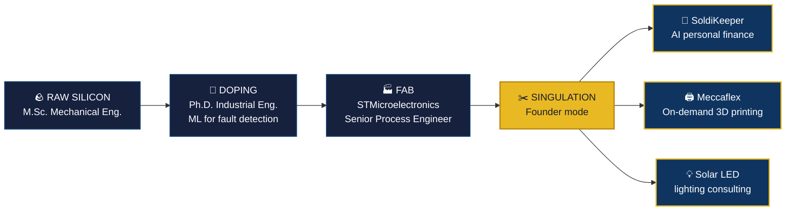

<!-- ═══════════════════════════════════════════════════════════════════
     MOISE UGWIRI — PROFILE README
     Design concept: a semiconductor "lot traveler" — this profile is a
     wafer moving through a fab. Every section is a process step.
     ═══════════════════════════════════════════════════════════════════ -->

 

 

<!-- ══════════════════ THE LOT TRAVELER ══════════════════ -->

## `⬡ LOT TRAVELER — UGWIRI.M.001`

> In a semiconductor fab, every wafer carries a **lot traveler** — a document tracking each process step it survives on the way to becoming something useful.
> This is mine.

<table align="center">
  <tr>
    <td><b>⚙️ PROCESS OWNER</b></td>
    <td>Semiconductor manufacturing — ~4 years at ST Marcianise (Grade 13)</td>
  </tr>
  <tr>
    <td><b>🧠 SPECIALTY DOPANT</b></td>
    <td>Machine Learning for industrial systems &amp; fault detection</td>
  </tr>
  <tr>
    <td><b>🌍 SUBSTRATE</b></td>
    <td>Congolese-Italian · builds in 🇮🇹 EN / FR / IT</td>
  </tr>
  <tr>
    <td><b>📈 YIELD PHILOSOPHY</b></td>
    <td>Technical depth × real startup execution. Ship, measure, iterate.</td>
  </tr>
</table>

 

<!-- ══════════════════ PRODUCTION LINES ══════════════════ -->

## `⬡ ACTIVE PRODUCTION LINES`

<table>
<tr>
<td width="50%" valign="top">

### 💰 SoldiKeeper
 

**AI-powered personal finance platform**

- 🧾 Receipt scanning powered by AI
- 📊 Smart expense tracking & budgeting
- 🤝 Bill splitting that doesn't ruin friendships

**→** [soldikeeper.com](https://soldikeeper.com) · [Admin Dashboard](https://admin-soldikeeper.vercel.app)

</td>
<td width="50%" valign="top">

### 🖨️ Meccaflex
 

**On-demand 3D printing & rapid prototyping**

- ⚡ Quotes in 24–72h, no minimum orders
- 🇮🇹 Built for Italian businesses
- 🚜 Focus: agriculture & manufacturing

**→** [meccaflex.com](https://meccaflex.com)

</td>
</tr>
</table>

 

<!-- ══════════════════ EQUIPMENT LIST ══════════════════ -->

## `⬡ EQUIPMENT LIST`

**` FRONT-END — Web & Product `**

**` BACK-END — ML, Engineering & Systems `**

 

| 🎯 Core strength | What it looks like in practice |
|---|---|
| **Production-grade React dashboards** | Real-time admin panels with live data viz (Recharts) |
| **ML for industry** | Fault detection models that run next to real machines |
| **Process engineering** | Yield, capability, and traceability at semiconductor scale |

 

<!-- ══════════════════ METROLOGY ══════════════════ -->

## `⬡ METROLOGY & INSPECTION`

 

<!-- ══════════════════ FINAL TEST & SHIP ══════════════════ -->

## `⬡ FINAL TEST → SHIP`

**Have a problem at the intersection of AI, fintech, semiconductors, or manufacturing?**
That's exactly where I like to work.

  

⬡ Lot UGWIRI.M.001 — passed final test. Shipped from Marcianise, Italy. 🇮🇹

